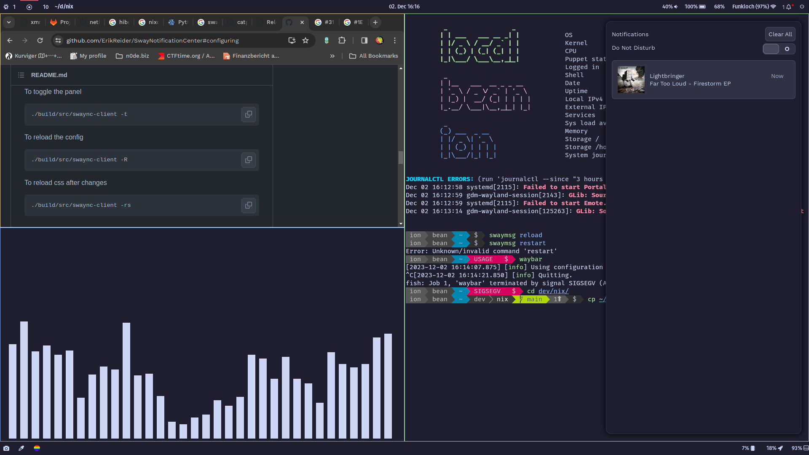

# Yubikey-centric NixOs flake

> Only intended for desktop usage

**Desktop:** [sway](https://github.com/swaywm/sway)  
**Terminal:** [kitty](https://github.com/kovidgoyal/kitty)  
**Shell:** [fish](https://github.com/fish-shell/fish-shell)  
**Filesystem:** [btrfs](https://github.com/kdave/btrfs-devel)  
**Firewall:** [opensnitch](https://github.com/evilsocket/opensnitch)  
**Secret-Management:** [gopass](https://github.com/gopasspw/gopass)  
**Features:**

- passwordless u2f_pam auth with yubikey [NixOs Wiki - Yubikey](https://nixos.wiki/wiki/Yubikey)
- luks fido2 encrypted with yubikey (passphrase as fallback)
- secrets managed at runtime with gopass (also backed by yubikey)

## Setup of a new host

1. Grab the latest ISO and boot it on your target machine
2. Identify installation drive '/dev/sda' if just one is present
3. Run `install-system generic`
   - You will be asked which disk to use for installation
   - You will be asked to provide a password for luks
   - You will be asked if you want to add a fido2 key to luks
4. Reboot into new system and login using yubikey
5. Run `sync-repos` to initialize password keystore and nix repo
6. Navigate to `~/dev/nix` and copy template files for the new host
   - `cp -r hosts/generic hosts/<NEW_HOST>`
   - `cp home/_mixins/users/ion/hosts/generic.nix home/_mixins/users/ion/hosts/<NEW_HOST>.nix`
7. Modify `hosts/<NEW_HOST>/default.nix` according to your needs
   - Make sure to replace `CHANGE_ME` with your target disks WWN-ID
8. Commit and push
9. Run `install-system <NEW_HOST>`

---

planned:

- netboot into minmal config accessibele by root via ssh
- deploy with deploy-rs
- kepp up2date with polling from client via autoupdate service

## Things to consider when forking or copying stuff

1. Change referenced ssh-keys in (grep for `cardno:13 338 635`):
   > Used for SSH auth and sudo
   - hosts/\_mixins/users/ion/default.nix
   - hosts/\_mixins/users/root/default.nix
   - home/\_mixins/users/ion/id_rsa_priv_yubikey.pub
   - hosts/\_mixins/users/nixos/default.nix
2. Update `home/_mixins/users/ion/u2f_keys`
   > Used by PAM for login and sudo
   - Get yours with `nix-shell -p pam_u2f --run 'pamu2fcfg -o "pam://$TARGET_HOST"'`
3. Add another Yubikey as backup
   > So you wont get locked out when losing a yubikey
   - luks: just enroll another yubikey with: `systemd-cryptenroll --fido2-device=auto <device>`
   - pam auth: add another yubikey to the `u2f_keys` file, `\n` seperated
   - ssh auth: add another ssh publickey to the ` *.nix` files listed in step 1, also `\n` seperated

## Screenshots

**Inspired by:**

- https://christine.website/blog/paranoid-nixos-2021-07-18/
